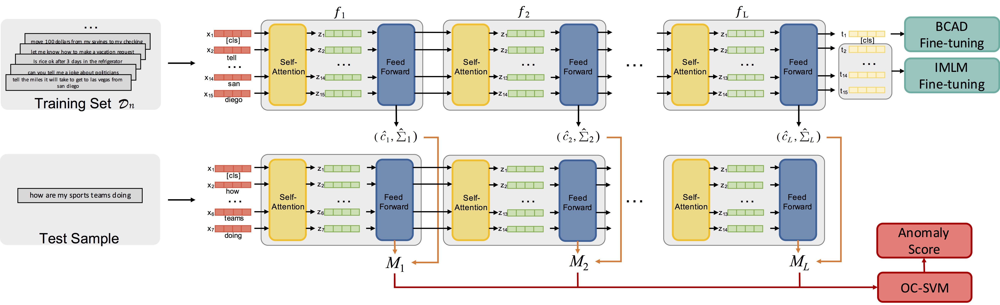

# BERT-unsupervised-OOD
Code for ACL 2021 paper "Unsupervised Out-of-Domain Detection via Pre-trained Transformers" by Keyang Xu, Tongzheng Ren, Shikun Zhang, Yihao Feng and Caiming Xiong.

## Requirements

* Python 3.7.3
* PyTorch 1.2
* Transformers 2.7.0
* SimpleTransformer

## Overview


## To run the models
Use the command 
```
python ood_main.py \
  --method MDF \
  --data_type clinic \
  --model_class bert \
```

To run baselines, change MDF to one from ['single_layer_bert', 'tf-idf', 'MSP']. 


## Fine-tuning BERT with BCAD and IMLM

### In-domain Masked Language Model (IMLM)
```
python finetune_bert.py \
    --type finetune_imlm \ 
    --data_type clinic \ 
    --model_class bert
```

### Binary   classification   with   auxiliary   dataset (BCAD)
```
python finetune_bert.py \
    --type finetune_binary \ 
    --data_type clinic \ 
    --model_class bert
    --load_path xxx
```
The ``load_path`` can be the output of IMLM fine-tuning. If no ``load_path`` is specified, then pre-trained bert model is used. 

You can use the fine-tuned model for OOD detection by adding the ``load_path`` parameter, e.g., 

```
python ood_main.py \
  --method MDF \
  --data_type clinic \
  --model_class bert \
  --load_path  xxx  
```

You can also downloaded our fine-tuned model here. 